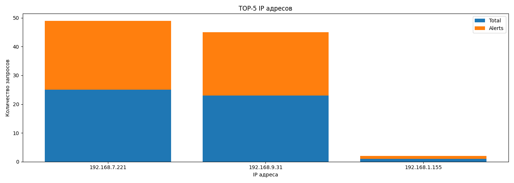

# Автоматизированный мониторинг и реагирование на угрозы
Скрипт производит загрузку, обработку и анализ логов Suricata. Выявляет подозрительные IP-адреса. С использованием внешнего сервиса VirusTotal обогащает IP информацией о потенциальных угрозах. На основании оценки угрозы, принимает решение о реагировании и имитирует блокировку IP через API Firewall. По итогам работы формирует отчет в формате json и визуализацию TOP5 угроз в формате png.

# Ключевые особенности логов (events.json):
В логах присутствуют два IP-адреса злоумышленников:
 - 192.168.7.221 - сканирует с User-Agent'ами различных сканеров (Nessus, sqlmap, Acunetix)
 - 192.168.9.31 - также проводит сканирование, используя другие инструменты (Nikto, OpenVAS, WPScan)

Помимо злоумышленников, в логе присутствуют фоновые события:
 - Обычные пользователи из сети 192.168.1.0/24
 - Нормальный HTTP-трафик с кодами 200
 - Редиректы (301)
 - Запросы статических ресурсов (CSS, JS, изображения)

# Процесс обработки логов
Для реализации скрипта использован паттерн проектирование Pipeline. Паттерн предполагает последовательное получение и обработку данных с передачей их между этапами. Реализован классов Pipeline и абстрактным классом этапа Stage.

## Этап 1. Чтение и анализ лога Suricata
Реализуется классом SuricataLogAnalyzerStage. На данном этапе прроизводится:
- загрузка Suricata из файла в формате JSON
- нормализация (очистка данных от дубликатов)
- анализ активности IP-адресов
- формирование перечня подозрительных ip-адресов
- очистка памяти
- передача сформированного перечня подозрительных ip на следующий этап

Пример вывода этапа:
``` python
======================================================================
НАЧАЛО ЭТАПА
Загрузка данных из файла логов Suricata
======================================================================
Загружаем данные...
Загружено 94 записей
Записей до нормализации: 94
Записей после нормализации: 92

ИНФОРМАЦИЯ О ЗАГРУЖЕННЫХ ДАННЫХ:
Файл: events.json
Всего записей: 92
Уникальных IP: 46
Распределение типов событий (event_type): {'alert': 47, 'http': 45}
Колонки в данных: ['timestamp', 'flow_id', 'pcap_cnt', 'event_type', 'src_ip', 'src_port', 'dest_ip', 'dest_port', 'proto', 'tx_id', 'http', 'app_proto', 'flow', 'alert']
Всего alert-событий: 47

АНАЛИЗ ПОДОЗРИТЕЛЬНЫХ IP-АДРЕСОВ:

IP адрес             Всего  Alerts  Порог
--------------------------------------------------
192.168.7.221        25       24       Да
192.168.9.31         23       22       Да
192.168.1.155        1        1        Нет
Очистка памяти завершена

======================================================================
КОНЕЦ ЭТАПА
Загрузка данных из файла логов Suricata
Данные на конец этапа: {'suspicious_ips': {'192.168.7.221': {'total_requests': 25, 'alert_requests': 24, 'activity_threshold': np.True_, 'has_alerts': True}, '192.168.9.31': {'total_requests': 23, 'alert_requests': 22, 'activity_threshold': np.True_, 'has_alerts': True}, '192.168.1.155': {'total_requests': 1, 'alert_requests': 1, 'activity_threshold': np.False_, 'has_alerts': True}}}
======================================================================
```

## Этап 2. Обогащение данными из Virustotal
Реализауетя классами VirusTotalStage (реально обращение), VirusTotalMockStage (мок). На данном этапе производится проверка выявленных на предыдущем этапе подозрительных ip в сервисе VirusTotal. Результат проверки обогощает предыдущие данные из логов и передается на следующий этап.

Пример вывода этапа:
``` python
======================================================================
НАЧАЛО ЭТАПА
Обогащение данными из Virustotal
======================================================================
Проверка 1/3: 192.168.1.155
Проверка 2/3: 192.168.9.31
Проверка 3/3: 192.168.7.221

РЕЗУЛЬТАТЫ ПРОВЕРКИ IP В VIRUSTOTAL:
192.168.1.155: ПОДОЗРИТЕЛЬНЫЙ
192.168.9.31: БЕЗОПАСНЫЙ
192.168.7.221: ПОДОЗРИТЕЛЬНЫЙ

======================================================================
КОНЕЦ ЭТАПА
Обогащение данными из Virustotal
Данные на конец этапа: {'suspicious_ips': {'192.168.7.221': {'total_requests': 25, 'alert_requests': 24, 'activity_threshold': np.True_, 'has_alerts': True}, '192.168.9.31': {'total_requests': 23, 'alert_requests': 22, 'activity_threshold': np.True_, 'has_alerts': True}, '192.168.1.155': {'total_requests': 1, 'alert_requests': 1, 'activity_threshold': np.False_, 'has_alerts': True}}, 'virustotal_ips': {'192.168.1.155': True, '192.168.9.31': False, '192.168.7.221': True}}
======================================================================
```

## Этап 3. Проверка условий для блокировки подозрительных ip
Реализуется классом CheckBlockConditionStage. На данном этапе провреяются условия, необходимые для блокировки IP на основании данных, полученных с предыдущих этапов. Если IP имеет высокую активность запросов или имеет отрицательную проверку в VirusTotal, принимается решение о его блокировке. Перечень IP с причинами блокировки передается на следующий этап.

Пример вывода этапа:
``` python
======================================================================
НАЧАЛО ЭТАПА
Проверка условий для блокировки IP
======================================================================
IP: 192.168.7.221 будет заблокирован из-за высокой активности (запросов = 25)
IP: 192.168.9.31 будет заблокирован из-за высокой активности (запросов = 23)
IP: 192.168.1.155 будет заблокирован из-за отрицательной проверки VirusTotal

СПИСОК IP И ПРИЧИНА ДЛЯ ПОСЛЕДУЮЩЕЙ БЛОКИРОВКИ:
192.168.7.221 block_by_score
192.168.9.31 block_by_score
192.168.1.155 block_by_virustotal

======================================================================
КОНЕЦ ЭТАПА
Проверка условий для блокировки IP
Данные на конец этапа: {'suspicious_ips': {'192.168.7.221': {'total_requests': 25, 'alert_requests': 24, 'activity_threshold': np.True_, 'has_alerts': True}, '192.168.9.31': {'total_requests': 23, 'alert_requests': 22, 'activity_threshold': np.True_, 'has_alerts': True}, '192.168.1.155': {'total_requests': 1, 'alert_requests': 1, 'activity_threshold': np.False_, 'has_alerts': True}}, 'virustotal_ips': {'192.168.1.155': True, '192.168.9.31': False, '192.168.7.221': True}, 'ips_for_block': {'192.168.7.221': 'block_by_score', '192.168.9.31': 'block_by_score', '192.168.1.155': 'block_by_virustotal'}}
======================================================================
```

## Этап 4. Блокировка подозрительных ip на firewall (мок)
Реализуется классами FirewallBanStage, FirewallBanMockStage (мок). Этап принимает перечень IP для блокировки с предыдущего этапа и производит обращение в абстрактный API Firewall для блокировки данного IP. По итогам формирует данные об успешной или неуспешной блокировке и передает их на слеующий этап.

Пример вывода этапа:
``` python
======================================================================
НАЧАЛО ЭТАПА
Блокировка подозрительных ip с помощью API Firewall
======================================================================
Блокировка 192.168.7.221... Заблокирован
Блокировка 192.168.9.31... Заблокирован
Блокировка 192.168.1.155... Заблокирован

СПИСОК IP И РЕЗУЛЬТАТ ИХ БЛОКИРОВКИ:
192.168.7.221 заблокирован
192.168.9.31 заблокирован
192.168.1.155 заблокирован

======================================================================
КОНЕЦ ЭТАПА
Блокировка подозрительных ip с помощью API Firewall
Данные на конец этапа: {'suspicious_ips': {'192.168.7.221': {'total_requests': 25, 'alert_requests': 24, 'activity_threshold': np.True_, 'has_alerts': True}, '192.168.9.31': {'total_requests': 23, 'alert_requests': 22, 'activity_threshold': np.True_, 'has_alerts': True}, '192.168.1.155': {'total_requests': 1, 'alert_requests': 1, 'activity_threshold': np.False_, 'has_alerts': True}}, 'virustotal_ips': {'192.168.1.155': True, '192.168.9.31': False, '192.168.7.221': True}, 'ips_for_block': {'192.168.7.221': 'block_by_score', '192.168.9.31': 'block_by_score', '192.168.1.155': 'block_by_virustotal'}, 'block_result': {'192.168.7.221': True, '192.168.9.31': True, '192.168.1.155': True}}
======================================================================
```

## Этап 5. Отправка почтовых оповещений о блокировке
Реализуется классом EmailNotifierStage . Формирует почтовое письмо и отправляет его по SMTP на почтовый сервер. В теле письма формируется текст с резльтатами блокировки IP-адресов на firewall, полученных с предыдущего этапа. Результат отправки письма сохраняется для обработки на последующих этапах.

Пример вывода этапа:
``` python
======================================================================
НАЧАЛО ЭТАПА
Отправка почтовых оповещений о блокировке
======================================================================
Тело отправляемого сообщения:

УВЕДОМЛЕНИЕ О БЛОКИРОВКЕ IP

Время: 2026-02-26 09:33:48
IP адресов для блокировки: 3

Результаты блокировки:

192.168.7.221 заблокирован
192.168.9.31 заблокирован
192.168.1.155 заблокирован

Ошибка отправки: [Errno 11001] getaddrinfo failed

======================================================================
КОНЕЦ ЭТАПА
Отправка почтовых оповещений о блокировкеn
Данные на конец этапа: {'suspicious_ips': {'192.168.7.221': {'total_requests': 25, 'alert_requests': 24, 'activity_threshold': np.True_, 'has_alerts': True}, '192.168.9.31': {'total_requests': 23, 'alert_requests': 22, 'activity_threshold': np.True_, 'has_alerts': True}, '192.168.1.155': {'total_requests': 1, 'alert_requests': 1, 'activity_threshold': np.False_, 'has_alerts': True}}, 'virustotal_ips': {'192.168.1.155': True, '192.168.9.31': False, '192.168.7.221': True}, 'ips_for_block': {'192.168.7.221': 'block_by_score', '192.168.9.31': 'block_by_score', '192.168.1.155': 'block_by_virustotal'}, 'block_result': {'192.168.7.221': True, '192.168.9.31': True, '192.168.1.155': True}, 'email_send_result': False}
======================================================================
```

## Этап 6. Формирование отчета и запись его в файл
Реализуется в классе IPReportStage . На данном этапе происходит соединение данных из разных этапов по ip-адресу, формируется итоговый отчет в формате json и сохраняется в файл .

[Пример отчета в файле](ip_report.json)

Пример вывода этапа:
``` python
======================================================================
НАЧАЛО ЭТАПА
Формирование отчета
======================================================================
Результат отчета:

192.168.7.221:
  suspicious_ips: {'total_requests': 25, 'alert_requests': 24, 'activity_threshold': np.True_, 'has_alerts': True}
  virustotal_ips: True
  ips_for_block: block_by_score
  block_result: True

192.168.9.31:
  suspicious_ips: {'total_requests': 23, 'alert_requests': 22, 'activity_threshold': np.True_, 'has_alerts': True}
  virustotal_ips: False
  ips_for_block: block_by_score
  block_result: True

192.168.1.155:
  suspicious_ips: {'total_requests': 1, 'alert_requests': 1, 'activity_threshold': np.False_, 'has_alerts': True}
  virustotal_ips: True
  ips_for_block: block_by_virustotal
  block_result: True
Отчет успешно сохранен в файл ip_report.json

======================================================================
КОНЕЦ ЭТАПА
Формирование отчета
Данные на конец этапа: {'suspicious_ips': {'192.168.7.221': {'total_requests': 25, 'alert_requests': 24, 'activity_threshold': np.True_, 'has_alerts': True}, '192.168.9.31': {'total_requests': 23, 'alert_requests': 22, 'activity_threshold': np.True_, 'has_alerts': True}, '192.168.1.155': {'total_requests': 1, 'alert_requests': 1, 'activity_threshold': np.False_, 'has_alerts': True}}, 'virustotal_ips': {'192.168.1.155': True, '192.168.9.31': False, '192.168.7.221': True}, 'ips_for_block': {'192.168.7.221': 'block_by_score', '192.168.9.31': 'block_by_score', '192.168.1.155': 'block_by_virustotal'}, 'block_result': {'192.168.7.221': True, '192.168.9.31': True, '192.168.1.155': True}, 'email_send_result': False, 'report_file_save': True}
======================================================================
```

## Этап 7. Формирование визуализации и запись в файл
Реализуется классом VisualizerStage . На данном этапе на основании данных с предыдущих этапов, формируется выборка TOP5 подозрительных IP, визуализируется статистика запросов в разере ip-адресов и сохраняется в файл.



Пример вывода этапа:
``` python
======================================================================
НАЧАЛО ЭТАПА
Формирование графиков и визуализации
======================================================================
Визуализация успешно сохранена в файл ip_report.png

======================================================================
КОНЕЦ ЭТАПА
Формирование графиков и визуализации
Данные на конец этапа: {'suspicious_ips': {'192.168.7.221': {'total_requests': 25, 'alert_requests': 24, 'activity_threshold': np.True_, 'has_alerts': True}, '192.168.9.31': {'total_requests': 23, 'alert_requests': 22, 'activity_threshold': np.True_, 'has_alerts': True}, '192.168.1.155': {'total_requests': 1, 'alert_requests': 1, 'activity_threshold': np.False_, 'has_alerts': True}}, 'virustotal_ips': {'192.168.1.155': True, '192.168.9.31': False, '192.168.7.221': True}, 'ips_for_block': {'192.168.7.221': 'block_by_score', '192.168.9.31': 'block_by_score', '192.168.1.155': 'block_by_virustotal'}, 'block_result': {'192.168.7.221': True, '192.168.9.31': True, '192.168.1.155': True}, 'email_send_result': False, 'report_file_save': True, 'visualize_file_save': True}
======================================================================
```
